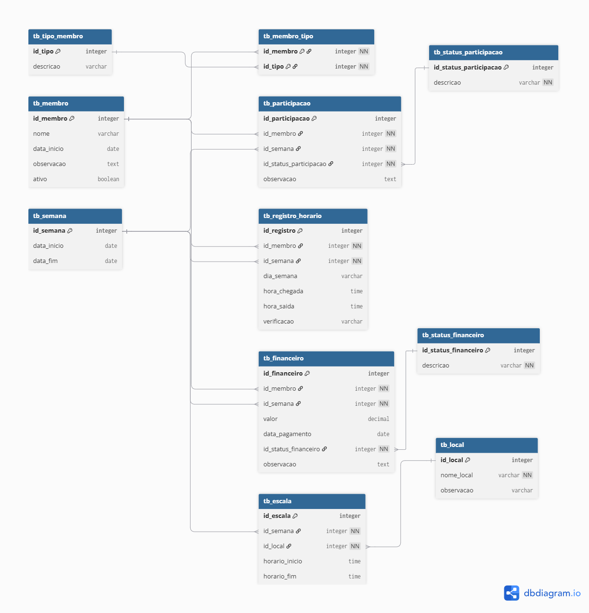

# controle-revezamento

# Sistema de Controle de Revezamento

Projeto desenvolvido para fins de estudo de modelagem de banco de dados e SQL.

## Objetivo

Controlar a participação de membros em escalas de revezamento, registrando:

- Participações semanais
- Horários de entrada e saída
- Escalas
- Controle financeiro
- Locais de atuação
- Tipos de membros

## Contexto

O projeto surgiu a partir de uma planilha Excel utilizada para organizar informações de um grupo de trabalho.

As informações eram compartilhadas por grupos de WhatsApp, contendo:

- Escalas semanais
- Horários
- Participação dos membros
- Informações financeiras

O objetivo foi transformar esse processo em um banco de dados estruturado.

## Modelo de Dados

## Tecnologias

- SQL
- Modelagem Relacional
- DBDiagram
- GitHub

## Funcionalidades

- Cadastro de membros
- Controle de tipos de membro
- Registro de participação
- Controle financeiro
- Registro de horários
- Gestão de escalas
- Controle de locais

## Autor

Maitê Lacerda
