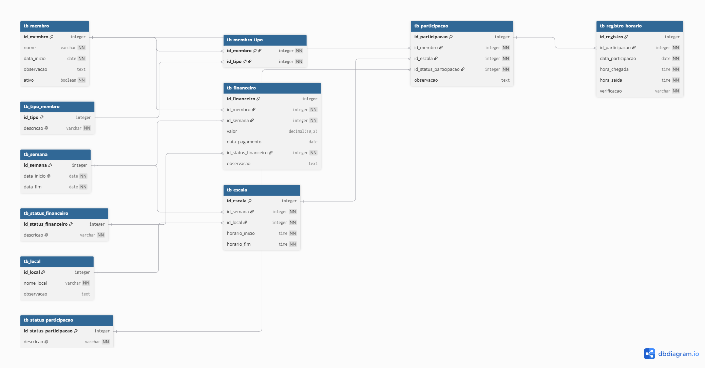

# Modelagem Lógica

## Objetivo

A modelagem lógica representa a estrutura do banco de dados do Sistema de Controle de Revezamento.

Nesta etapa são definidas as entidades, seus atributos, chaves primárias, chaves estrangeiras e relacionamentos, preparando a estrutura para a implementação física no banco de dados.

---

# Estrutura do Modelo

O modelo lógico foi desenvolvido seguindo os princípios da modelagem relacional, priorizando:

- Integridade dos dados;
- Eliminação de redundâncias;
- Facilidade de manutenção;
- Preservação do histórico das informações;
- Escalabilidade para futuras evoluções do sistema.

O modelo é composto pelas seguintes tabelas:

- `tb_membro`
- `tb_tipo_membro`
- `tb_membro_tipo`
- `tb_semana`
- `tb_escala`
- `tb_local`
- `tb_participacao`
- `tb_registro_horario`
- `tb_status_participacao`
- `tb_financeiro`
- `tb_status_financeiro`

---

# Principais Relacionamentos

A estrutura lógica contempla os seguintes relacionamentos:

- Um membro pode possuir diversos tipos de membro (N:N).
- Um tipo de membro pode ser associado a diversos membros (N:N).
- Uma semana pode possuir diversas escalas (1:N).
- Um local pode ser utilizado em diversas escalas (1:N).
- Uma escala pode possuir diversas participações (1:N).
- Um membro pode possuir diversas participações (1:N).
- Uma participação pode possuir diversos registros de horário (1:N).
- Um membro pode possuir diversos registros financeiros (1:N).
- Uma semana pode possuir diversos registros financeiros (1:N).
- Um status de participação pode ser utilizado por diversas participações (1:N).
- Um status financeiro pode ser utilizado por diversos registros financeiros (1:N).

---

# Diagrama do Modelo Lógico

A figura abaixo apresenta o diagrama lógico do banco de dados.

---

# Considerações sobre a Modelagem

Durante o desenvolvimento do modelo lógico foram adotadas algumas decisões importantes:

- A relação entre membros e tipos de membro foi implementada por meio de uma tabela associativa (`tb_membro_tipo`), caracterizando um relacionamento muitos-para-muitos.

- A tabela `tb_participacao` representa a participação de um membro em uma determinada escala, permitindo registrar o histórico das atividades realizadas.

- A tabela `tb_registro_horario` foi vinculada à participação, possibilitando que uma mesma participação possua diversos registros de horários em diferentes datas e períodos.

- O controle financeiro foi separado da participação, permitindo registrar pagamentos, adiantamentos e situações financeiras de forma independente.

- Os cadastros de domínio (tipos de membro e status) foram separados em tabelas específicas para garantir padronização e evitar duplicidade de informações.

---

# Conclusão

O modelo lógico representa a estrutura final do banco de dados e servirá como base para a implementação física em SQL.

As decisões de modelagem adotadas buscam garantir consistência, flexibilidade e facilidade de manutenção, além de permitir futuras expansões do sistema sem necessidade de alterações estruturais significativas.